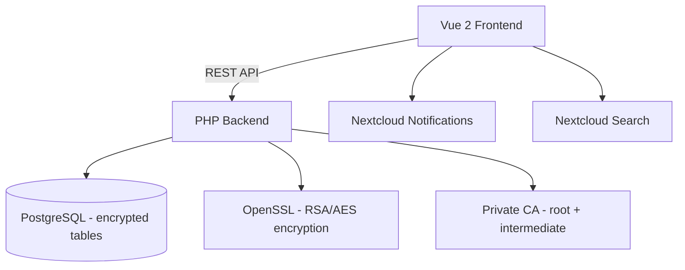

<p align="center">
  
</p>

<h1 align="center">Keepiq</h1>

<p align="center">
  <strong>Encrypted secrets manager for Nextcloud — password manager and key store for users and applications</strong>
</p>

<p align="center">
  <a href="https://github.com/ConductionNL/keepiq/releases"></a>
  <a href="https://github.com/ConductionNL/keepiq/blob/main/LICENSE"></a>
  <a href="https://github.com/ConductionNL/keepiq/actions"></a>
</p>

---

Securely store and share secrets (passwords, API keys, certificates) for Nextcloud users and applications, using end-to-end RSA/AES encryption backed by a private Certificate Authority.

> **Thick backend architecture** — Keepiq owns its own encrypted database tables. No OpenRegister dependency. All secrets are encrypted at rest with RSA-4096 public keys; private keys are AES-256 wrapped with a master password derived key.

## Screenshots

_Add screenshots here once the app has a UI._

## Features

Features are defined in [`openspec/specs/`](openspec/specs/). See the [roadmap](openspec/ROADMAP.md) for planned work. See [`docs/FEATURES.md`](docs/FEATURES.md) for the full competitive analysis and feature matrix.

### Core
- **Encrypted vault** — RSA-4096 + AES-256 encryption with a private Certificate Authority
- **Secret management** — Store passwords, API keys, SSH keys, certificates, and notes
- **Sharing** — Share with Nextcloud users/groups, password-protected links, secret requests
- **Application management** — CSR-based registration, write-without-read for application secrets
- **Key generator** — Configurable password generation with strength feedback

### Supporting
- **Lock screen** — Full-page master password entry with session timeout
- **Admin settings** — CA health, password policies, application approval queue
- **NL Design System** — Government theming support, WCAG AA compliance
- **Quality pipeline** — PHPCS, PHPMD, Psalm, PHPStan, ESLint, Stylelint

## Architecture



_See [`docs/ARCHITECTURE.md`](docs/ARCHITECTURE.md) for the full architecture document._

### Data Model

| Entity | Description |
|--------|-------------|
| EncryptionSuite | RSA key pair + CA certificate per user/application |
| CACertificate | Root (20yr) and intermediate (3yr) CA certificates |
| Secret | Encrypted credential with type-specific fields |
| SecretType | Classification system (login, api_key, ssh_key, certificate, note, database) |
| Folder | Hierarchical organization (tree per user) |
| Application | External system with its own EncryptionSuite |
| SecretShare | User-to-user encrypted secret copy |
| LinkShare | Password-protected point-in-time snapshot |
| SecretRequest | Write-without-read fill-in link |

### Directory Structure

```
keepiq/
├── appinfo/                    # Nextcloud app manifest, routes, navigation
├── lib/                        # PHP backend
│   ├── AppInfo/Application.php
│   ├── Controller/             # DashboardController, SettingsController
│   ├── Service/SettingsService.php
│   ├── Listener/DeepLinkRegistrationListener.php
│   ├── Repair/InitializeSettings.php
│   └── Settings/               # AdminSettings, keepiq_register.json
├── templates/                  # PHP templates (SPA shells)
├── src/                        # Vue 2 frontend
│   ├── main.js                 # App entry point
│   ├── App.vue                 # Root component
│   ├── navigation/MainMenu.vue # App navigation sidebar
│   ├── router/                 # Vue Router
│   ├── store/                  # Pinia stores
│   └── views/                  # Route-level views + UserSettings.vue
├── openspec/                   # Specifications, decisions, and roadmap
│   ├── app-config.json         # Canonical app config (id, goal, dependencies, CI)
│   ├── config.yaml             # OpenSpec CLI configuration
│   ├── specs/                  # Feature specs (input for OpenSpec changes)
│   ├── architecture/           # App-specific Architectural Decision Records
│   ├── ROADMAP.md              # Product roadmap
│   └── changes/                # OpenSpec change directories (created on first change)
├── docs/                       # Design documentation
│   ├── ARCHITECTURE.md         # Standards, data model, integrations
│   ├── FEATURES.md             # Competitive analysis, feature matrix
│   └── DESIGN-REFERENCES.md    # Design patterns, ASCII wireframes
├── docusaurus/                 # Documentation site
├── tests/                      # Unit and integration tests
├── l10n/                       # Translations (en, nl)
├── .github/workflows/          # CI/CD pipelines
└── img/                        # App icons and screenshots
```

## Requirements

| Dependency | Version |
|-----------|---------|
| Nextcloud | 28 – 33 |
| PHP | 8.1+ |
| Node.js | 20+ |

## Installation

### From the Nextcloud App Store

1. Go to **Apps** in your Nextcloud instance
2. Search for **Keepiq**
3. Click **Download and enable**

### From Source

```bash
cd /var/www/html/custom_apps
git clone https://github.com/ConductionNL/keepiq.git keepiq
cd keepiq
npm install && npm run build
php occ app:enable keepiq
```

## Development

### Start the environment

Requires a sibling checkout of [openregister](https://github.com/ConductionNL/openregister)
next to this repo (`../openregister`) — Keepiq builds on OpenRegister's AppHost engine.

```bash
composer install && npm install && npm run build
docker compose up -d
```

Nextcloud is served at http://localhost:8080 (admin/admin). Both `openregister`
and `keepiq` are enabled automatically on every container start by the
`before-starting` hook in `docker/nextcloud/enable-apps.sh`.

### Frontend development

```bash
npm install
npm run dev        # Watch mode
npm run build      # Production build
```

### Code quality

```bash
# PHP
composer check:strict   # All quality checks (PHPCS, PHPMD, Psalm, PHPStan, tests)
composer cs:fix         # Auto-fix PHPCS issues
composer phpmd          # Mess detection
composer phpmetrics     # HTML metrics report

# Frontend
npm run lint            # ESLint
npm run stylelint       # CSS linting
```

### Enable locally

The docker compose stack enables both apps automatically on every start. To
(re-)enable them by hand — e.g. after disabling them, without restarting:

```bash
npm install && npm run build
docker exec nextcloud php occ app:enable openregister
docker exec nextcloud php occ app:enable keepiq
```

## Tech Stack

| Layer | Technology |
|-------|-----------|
| Frontend | Vue 2.7, Pinia, @nextcloud/vue |
| Build | Webpack 5, @nextcloud/webpack-vue-config |
| Backend | PHP 8.1+, Nextcloud App Framework, OpenSSL |
| Data | PostgreSQL (own encrypted tables) |
| UX | @conduction/nextcloud-vue |
| Quality | PHPCS, PHPMD, Psalm, PHPStan, ESLint, Stylelint |

## Branches

| Branch | Purpose |
|--------|---------|
| `main` | Stable releases — triggers release workflow |
| `beta` | Beta / pre-release builds |
| `development` | Active development — merge target for feature branches |

## Documentation

| Resource | Description |
|----------|-------------|
| [`docs/ARCHITECTURE.md`](docs/ARCHITECTURE.md) | Standards research, data model, Nextcloud integration |
| [`docs/FEATURES.md`](docs/FEATURES.md) | Competitive analysis, feature matrix (90 features) |
| [`docs/DESIGN-REFERENCES.md`](docs/DESIGN-REFERENCES.md) | Design patterns, 12 ASCII wireframes |
| [`openspec/app-config.json`](openspec/app-config.json) | App identity, goals, dependencies, and CI configuration |
| [`openspec/specs/`](openspec/specs/) | Feature specs — what the app should do |
| [`openspec/architecture/`](openspec/architecture/) | App-specific Architectural Decision Records (3 ADRs) |
| [`openspec/ROADMAP.md`](openspec/ROADMAP.md) | Product roadmap |

## Standards & Compliance

- **Encryption:** RSA-4096 + AES-256, X.509 PKI, NIST SP 800-57
- **Password Policy:** zxcvbn scoring, NIST SP 800-63B
- **Accessibility:** WCAG AA (Dutch government requirement)
- **Localization:** English and Dutch
- **Audit trail:** Full change history on all operations

## Related Apps

- **[OpenConnector](https://github.com/ConductionNL/openconnector)** — Uses Keepiq as a secret store for connector API credentials

_Add related apps here as integrations are built._

## Troubleshooting

### App UI is blank after enabling

The `js/` build output is not committed to the repo. Run the frontend build before enabling the app:

```bash
npm install && npm run build
```

## Support

For support, contact us at [support@conduction.nl](mailto:support@conduction.nl).

For a Service Level Agreement (SLA), contact [sales@conduction.nl](mailto:sales@conduction.nl).

## License

This project is licensed under the [EUPL-1.2](LICENSE).

### Dependency license policy

All dependencies (PHP and JavaScript) are automatically checked against an approved license allowlist during CI. The following SPDX license families are approved:

- **Permissive:** MIT, ISC, BSD-2-Clause, BSD-3-Clause, 0BSD, Apache-2.0, Unlicense, CC0-1.0, CC-BY-3.0, CC-BY-4.0, Zlib, BlueOak-1.0.0, Artistic-2.0, BSL-1.0
- **Copyleft (EUPL-compatible):** LGPL-2.0/2.1/3.0, GPL-2.0/3.0, AGPL-3.0, EUPL-1.1/1.2, MPL-2.0
- **Font licenses:** OFL-1.0, OFL-1.1

## Authors

Built by [Conduction](https://conduction.nl) — open-source software for Dutch government and public sector organizations.
